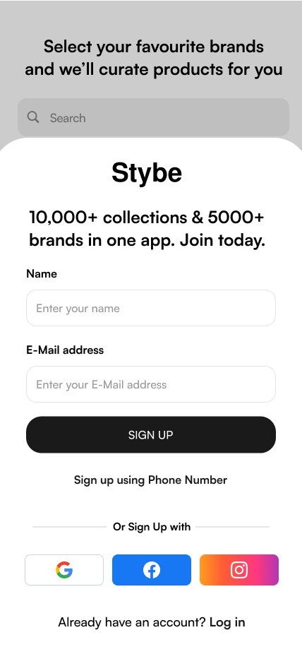
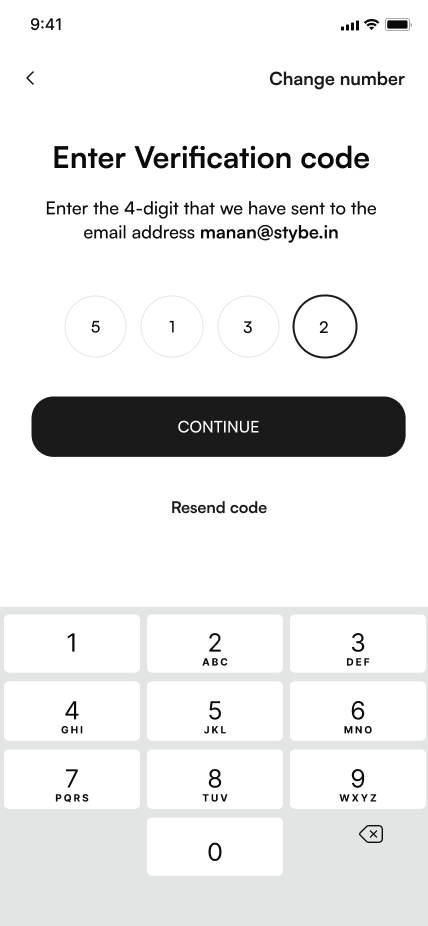

# frontend-interview

## Problem Statement
The task is to create a basic signup using OTP page.

1. Here is the Signup using email page.


2. Here is the Verify OTP page.


**Important: This repo contains boilerplate code, please use it.**

If you don't use the given boilerplate, your submission would be considered invalid.

You need to write tests and it is a must.

Write unit tests using Jest and e2e tests using cypress.

You need to write code in TypeScript.

We are using **NextJS** as frontend framework.

The code is inside `otp_signup` directory.

Make meaningful commits and meaningful README.

Once you are done with the UI implementation, we will provide you with API endpoint.

Code coverage must not fall below **98%**.

You need to raise the PR if you want to submit the code.

We will provide feedback in the PR itself.

It must contains the following commands.
 - To run the tests: ```npm run test```
 - To run the coverage: ```npm run coverage ```
 - To run the local server: ```npm run dev```
 - To produce the production build: ```npm run build```
